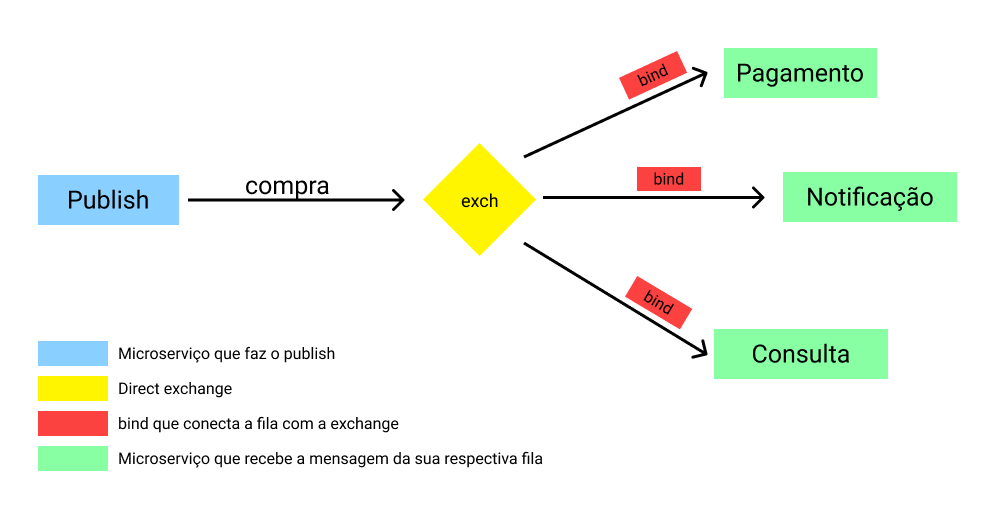

# Repositório de Estudo sobre RabbitMQ

## Diagrama:

<h1 align="center" >
    
</h1>

## Descrição:

Os scripts `notify`, `report` e `payment` simulam uma espécie de micro serviços para conexão e comunicação por mensageria usando `RabbitMQ`. No momento funcionam de forma separada precisando serem rodados individualmente e separadamente. Eles recebem mensagens do script de `publish`.
Para rodar um servidor `rabbitmq` preferi rodar uma imagem local do docker que pode ser acessada no endereço `localhost:15672` utilizando as seguntes credenciais:
    - Usuário: `guest`
    - Senha: `guest`

## Como testar:

- `pip install -r requirements.txt`
- `docker run --rm -it --hostname my-rabbit -p 15672:15672 -p 5672:5672 rabbitmq:3-management`
- execute os scripts `publish`, `notify`, `report` e `payment`.